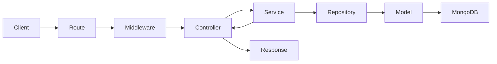
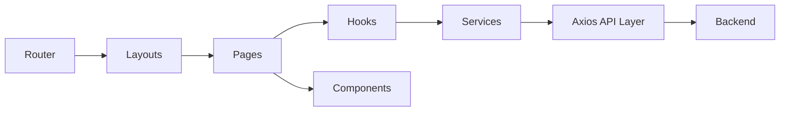
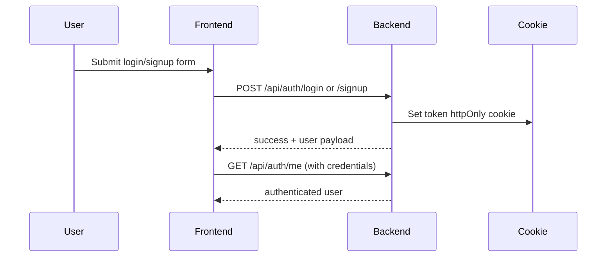

# System Architecture

## Overview
The system is split into two independently deployable parts:

- a React frontend in [`frontend/`](frontend/)
- an Express API in [`backend/`](backend/)

MongoDB is the persistent data store used by the backend. The frontend never talks to MongoDB directly.

```mermaid
flowchart LR
  Browser[Frontend SPA]
  Api[Express API]
  Db[(MongoDB)]

  Browser -->|HTTP(S) + Cookie| Api
  Api --> Db
```

## Why This Architecture
This architecture was chosen to keep the system simple for a small team while still enforcing strong boundaries:

- the frontend focuses on presentation, routing, and user interaction
- the backend owns business rules, validation, authentication, and persistence
- the database remains hidden behind repositories and services
- auth is handled with HTTP-only cookies, which avoids exposing tokens to frontend storage

For a small-scale internal tool, this keeps complexity low without collapsing everything into monolithic handlers or oversized UI components.

## Backend Architecture
The backend follows a layered design:

```text
routes -> controllers -> services -> repositories -> models
```

### Layer Responsibilities
- `routes/`
  - define URL paths and HTTP methods
  - attach middleware such as auth and validation
- `controllers/`
  - translate HTTP requests into service calls
  - return responses using the shared success envelope
- `services/`
  - implement business rules
  - enforce ownership checks and cross-entity logic
  - throw domain-aware `AppError` instances
- `repositories/`
  - contain Mongoose query logic
  - isolate persistence concerns from business logic
- `models/`
  - define MongoDB schemas and indexes

### Backend Request Lifecycle


### Cross-Cutting Backend Concerns
- configuration in [`backend/src/config/`](backend/src/config/)
- centralized error handling in [`backend/src/middleware/error.middleware.ts`](backend/src/middleware/error.middleware.ts)
- request logging in [`backend/src/middleware/requestLogger.middleware.ts`](backend/src/middleware/requestLogger.middleware.ts)
- input validation through Zod schemas in [`backend/src/validators/`](backend/src/validators/)
- shared response and error utilities in [`backend/src/utils/`](backend/src/utils/)

## Frontend Architecture
The frontend follows a composition pattern built around React Router, React Query, context, and a thin service layer.

```text
pages -> hooks -> services -> api/axios
pages -> components
layouts -> pages
context -> auth/session state
```

### Frontend Layer Responsibilities
- `pages/`
  - route-level screens such as login, signup, dashboard, and project board
- `components/`
  - reusable UI building blocks such as `Board`, `Column`, `TaskCard`, and `ProjectCard`
- `hooks/`
  - data fetching and mutation orchestration via React Query
- `services/`
  - endpoint-specific API calls
- `api/`
  - shared Axios instance and interceptor behavior
- `context/`
  - global auth/session state based on `/api/auth/me`

### Frontend Render and Data Flow


## Authentication Flow
Authentication uses JWT stored in an HTTP-only cookie.

### Flow
1. A user signs up or logs in from the frontend.
2. The backend validates the payload, authenticates the user, and signs a JWT.
3. The backend stores the JWT in the `token` cookie with `httpOnly: true`.
4. The frontend never stores the token in local storage or session storage.
5. The frontend determines auth state by calling `GET /api/auth/me`.
6. Protected frontend routes render only when `/api/auth/me` returns a valid authenticated user.



## Data Flow Example

### Example: Create task from the board
1. `ProjectPage` opens `TaskModal`.
2. The modal submits form data to `useTasks(projectId)`.
3. `useTasks` calls `taskService.createTask(projectId, payload)`.
4. `taskService` uses the shared Axios client.
5. The backend route validates the request and checks project ownership.
6. The service creates the task and returns it in the standard response envelope.
7. React Query updates the cached board state.
8. The board re-renders with the new task.

## Current Domain Model

### Implemented
- `User`
- `Project`
- `Column`
- `Task`

### Ready For Future Extension
- `ProjectUser` or similar membership model
- role/permission claims in the auth context
- custom task fields per project
- project-specific schema configuration

## Scalability Considerations

### RBAC Readiness
RBAC is not implemented yet, but the codebase already leaves room for it:

- authenticated request data is normalized into `request.user`
- services already check project ownership before modifying data
- repositories are separated, so a future `ProjectUser` repository can be introduced without pushing role logic into controllers
- auth token payloads and request typing can be extended with role claims later

### Dynamic Form Schema Readiness
Dynamic task fields are not implemented, but the current design supports future extension:

- project and task logic are separated cleanly
- board data is returned as a structured payload that can later include schema metadata
- frontend pages use hooks and services rather than hardcoded API calls in components
- modal-based task editing can be extended to render schema-driven fields

## Engineering Trade-Offs
- Cookie-based auth was chosen over local storage for better token handling security.
- React Query is used only for server state; local UI state stays local to pages/components.
- The backend uses a service/repository split even though the app is small, because it keeps future RBAC and project access rules manageable.
- Default project columns are created automatically, which simplifies frontend onboarding and keeps board assumptions consistent.

## Related Documents
- [`README.md`](README.md)
- [`DEPLOYMENT.md`](DEPLOYMENT.md)
- [`backend/ARCHITECTURE.md`](backend/ARCHITECTURE.md)
- [`frontend/ARCHITECTURE.md`](frontend/ARCHITECTURE.md)
